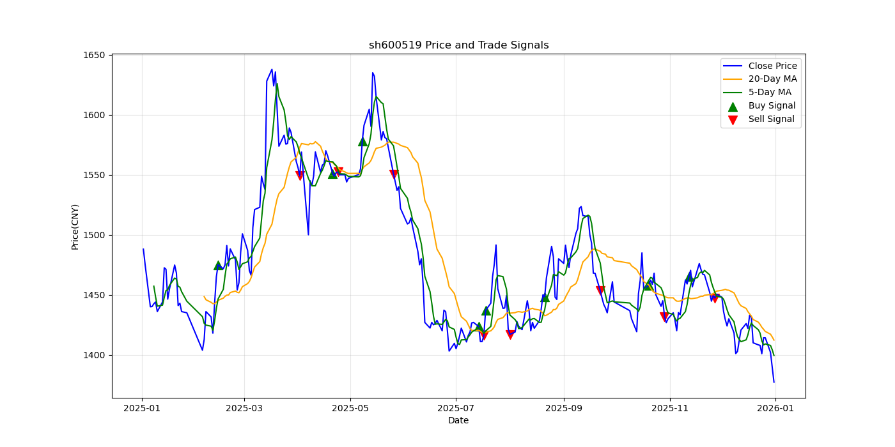

# A股双均线策略回测与过滤条件适用性研究

> 一个从零构建的量化策略研究项目：从双均线回测出发，逐步测试 ADX、RSI、成交量三个过滤条件，最终发现过滤条件的有效性高度依赖标的的行业特征。

---

## 📌 项目背景

本项目是我从计算机背景转向金融数据分析/量化研究方向过程中的实战项目。目标不是"造一个赚钱的策略"，而是**完整走一遍策略研究的科学流程**：

1. 构建基础策略（双均线）
2. 参数敏感性分析
3. 引入过滤条件（ADX / RSI / 成交量）
4. 多时间尺度验证（短区间 vs 长区间）
5. 跨标的验证（10 只不同行业的股票）
6. 从"个案观察"提炼出"可解释的规律"

**核心结论**：没有任何单一过滤条件在所有标的上都有效。过滤条件的有效性高度依赖标的的行业特征，必须根据标的的统计特征选择是否启用。

---

## 🛠️ 技术栈

- **Python 3.10+**
- **akshare** — A 股历史行情数据获取
- **pandas / numpy** — 数据清洗与向量化计算
- **matplotlib** — 交易信号可视化
- **statsmodels**（可选）— 统计检验

---

## 📂 项目结构

```
.
├── aks_use.py              # MA5和MA20对比的程序
├── aks_use_entire.py       # 多组窗口参数对比的程序
├── README.md               # 项目说明
├── param_comparison_*.csv         # 各股票参数对比结果
└── sh600519_trading_signals.png   # 运行后自动生成的交易信号图
```

## 🚀 快速开始

### 1. 安装依赖

```bash
pip install akshare pandas numpy matplotlib
```

### 2. 运行回测

```bash
# python aks_use.py
python aks_use_entire.py
```

### 3. 输出结果

程序会：
- 对每只股票打印单次回测、参数对比、过滤条件对比结果
- 生成 param_comparison_{股票代码}_{股票名称}.csv
- 生成 {股票代码}_trading_signals.png（含均线及买卖点标记）

## 📈 策略逻辑

**基础策略：双均线趋势跟踪（Dual Moving Average）** 是最经典的趋势跟踪策略之一：

- **金叉买入**：当短期均线（MA_short）上穿长期均线（MA_long）
- **死叉卖出**：当短期均线下穿长期均线

策略假设：短期均线代表近期价格动能，长期均线代表趋势方向。当短期动能向上突破长期趋势时，视为买入信号。

## 💰 交易成本模拟

为贴近实盘，回测中加入了以下成本：

| 成本类型 | 费率 | 说明 |
| :--- | :--- | :--- |
| 佣金 | 0.03% | 买卖双向收取 |
| 印花税 | 0.1% | 仅卖出时收取 |

> 初始资金：**500 万元**；最小交易单位：**100 股（1 手）**。

## 📊 绩效指标

| 指标 | 计算方式 | 含义 |
| :--- | :--- | :--- |
| **累计收益率** | `(总资产 / 初始资金) - 1` | 策略整体盈亏 |
| **夏普比率** | `(年化收益 - 无风险利率) / 年化波动率` | 每承担一单位风险获得的超额收益 |
| **最大回撤 (MDD)** | `max( (总资产 - 历史最高) / 历史最高 )` | 最坏情况下的亏损幅度 |
| **胜率** | `盈利交易数 / 总交易数` | 交易信号的准确性 |
| **盈亏比** | `总盈利 / 总亏损` | 盈利交易的收益覆盖亏损的能力 |

> 无风险利率假设为 **3%**，年化交易日按 **252 天** 计算。

## 🖼️ 交易信号示例



*贵州茅台（600519）双均线策略买卖点示意*

## 🔍 回测结果示例

> 回测区间：2025-01-01 至 2026-01-01，标的：贵州茅台（600519）

# 结果来自aks_use.py
**交易记录：**

| 日期 | 操作 | 价格 (CNY) | 数量 (股) |
| :--- | :--- | :--- | :--- |
| 2025-02-14 | 买入 | 1475.00 | 3300 |
| 2025-04-02 | 卖出 | 1549.02 | 3300 |
| 2025-04-21 | 买入 | 1551.00 | 3300 |
| 2025-04-24 | 卖出 | 1552.25 | 3300 |
| 2025-05-08 | 买入 | 1578.19 | 3300 |
| 2025-05-26 | 卖出 | 1550.50 | 3300 |
| 2025-07-14 | 买入 | 1423.60 | 3600 |
| 2025-07-17 | 卖出 | 1416.35 | 3600 |
| 2025-07-18 | 买入 | 1437.00 | 3500 |
| 2025-08-01 | 卖出 | 1417.00 | 3500 |
| 2025-08-21 | 买入 | 1448.25 | 3400 |
| 2025-09-22 | 卖出 | 1453.35 | 3400 |
| 2025-10-20 | 买入 | 1457.93 | 3400 |
| 2025-10-29 | 卖出 | 1431.90 | 3400 |
| 2025-11-12 | 买入 | 1465.15 | 3300 |
| 2025-11-27 | 卖出 | 1447.30 | 3300 |

**绩效指标：**

| 指标 | 数值 |
| :--- | :--- |
| 总买卖点 | 17 次 |
| 实际成交 | 16 次 |
| 最终股价 | 1377.18 CNY |
| 最终总资产 | 4,866,834.03 CNY |
| **累计收益率** | **-2.66%** |
| **夏普比率** | **-0.43** |
| **最大回撤 (MDD)** | **-12.13%** |
| **盈亏比** | **0.79** |
| **胜率** | **37.50%** |

**结果解读：**

- 该参数组合（MA5/MA20）在回测区间内**未能盈利**，累计收益 -2.66%。
- 胜率仅 37.5%，说明超过六成的交易以亏损离场，符合双均线策略在**震荡市**中频繁被"假突破"打脸的典型特征。
- 盈亏比 0.79 < 1，说明单笔盈利不足以覆盖单笔亏损。


## 🧠 策略思考与局限

- **趋势市有效，震荡市失效**：双均线是趋势跟踪策略，在单边行情中表现较好，但在横盘震荡中会产生大量假信号，吸引散户入场。
- **参数敏感性**：5/20 是经验参数，未必最优。后续可尝试网格搜索寻找更优参数组合。
- **未考虑滑点与流动性**：真实交易中，大额订单可能影响成交价格。
- **单一标的**：当前只回测单只股票，后续可扩展到多标的组合。


## 📊 参数敏感性分析 结果来自aks_use_entire.py
## 2026/09/11新增多设置几组参数以对比
对以下 5 组均线参数在同一区间（2020-01-01 ~ 2026-01-01，贵州茅台）进行回测：

| 参数组合 | 累计收益率 | 夏普比率 | 最大回撤 | 胜率 | 盈亏比 | 交易次数 |
| :--- | :--- | :--- | :--- | :--- | :--- | :--- |
| MA5/MA20 | -15.38% | 0.07 | -40.33% | 32.61% | 1.20 | 46 |
| MA10/MA30 | +7.32% | 0.00 | -40.47% | 26.92% | 1.12 | 26 |
| MA5/MA60 | +25.35% | 0.14 | -37.39% | 39.13% | 1.56 | 23 |
| MA10/MA60 | +20.87% | 0.11 | -41.15% | 33.33% | 1.53 | 18 |
| **MA20/MA60** | **+36.36%** | **0.22** | **-39.68%** | **50.00%** | **1.76** | **14** |

**核心发现：**

1. **长周期均线表现更稳健**：MA20/MA60 收益最高（+36.36%），夏普最高（0.22），胜率最高（50%）。
2. **短周期均线交易频繁但亏损**：MA5/MA20 交易 46 次，收益仅 +15.38%，说明频繁交易增加了成本。
3. **所有参数组合的最大回撤均在 -37% 至 -41% 之间**：单纯的趋势跟踪策略在 A 股市场需要更严格的风险控制。
4. **参数表现与市场状态强相关**：不同时间区间下，最优参数可能完全不同。
5. **Others**：Others。
**不存在万能参数，后续可考虑加入趋势过滤（如 ADX）动态调整。**


## 2026/9/15 ADX趋势过滤实验：一个完整的过拟合案例
## 2026/9/16 将回测时间增长为6年，从2020-2026
## 🔬 过滤条件实验
### 实验设计
在双均线策略基础上，分别测试三个过滤条件对买入信号的改进效果：

过滤条件	买入条件
**ADX 过滤**	金叉 + ADX > 25 + +DI > -DI（趋势向上且足够强）
**RSI 过滤**	金叉 + 50 < RSI < 阈值（排除超买和弱势中的金叉）
**成交量过滤**	金叉 + 当日成交量 > 20 日均量的 1.5 倍（放量突破）
卖出条件统一为：死叉即卖出，不加任何过滤条件。

#### 实验一：ADX 过滤（单标的，多阈值）
对贵州茅台（2020-2026，MA5/MA20）测试不同 ADX 阈值：

ADX 阈值	累计收益率	夏普比率	最大回撤	胜率	盈亏比	交易次数
**无过滤（基准）**	 **+15.38%**	**0.07**	-40.33%	32.61%	1.20	46
> 20	-27.17%	-0.87	-29.47%	12.50%	0.24	16
> 25	-12.90%	-0.69	-20.42%	12.50%	0.42	8
> 30	-2.61%	-0.70	-10.40%	25.00%	0.81	4
> 35	-3.21%	-1.79	-5.48%	0.00%	0.00	1
核心发现：

1.**所有 ADX 阈值版本均跑不赢基准**：ADX 过滤在长区间不仅没有改善，反而使收益由正转负。

2.**ADX 阈值越高，回撤越小，但收益越差**：从 > 20 到 > 35，最大回撤从 -29.47% 降至 -5.48%，但收益始终为负。这说明 ADX 过滤是在"砍交易"，而非"选好交易"。

3.**ADX > 35 时仅 1 次交易，无统计意义**：不能据此认为"高阈值更安全"，只能说明样本量过小。

4.**ADX 的两次平滑导致信号严重滞后**：当 ADX 确认趋势时，行情可能已经走完大半，导致买入即被套。

#### 实验二：短区间 vs 长区间的过拟合验证
将 ADX > 25 过滤在短区间（2025-2026）和长区间（2020-2026）上分别测试：

区间	基准版收益	ADX>25 收益	ADX 过滤效果
2025-2026（1年）	-2.66%	+4.04%	✅ 改善
2020-2026（6年）	+15.38%	-12.90%	❌ 恶化
核心发现：

1.**短区间有效，长区间恶化**：同一个过滤条件在 1 年区间改善收益，在 6 年区间反而使收益由正转负。这说明短区间的"改善"很可能是运气，而非规律。

2.**这是典型的过拟合特征**：在特定时间段表现好，但不具备跨时间的稳健性。

3.**教训**：任何单一指标过滤条件，必须在多个时间尺度上验证。

#### 实验三：RSI 过滤（单标的，多阈值）
对贵州茅台（2020-2026，MA5/MA20）测试不同 RSI 高阈值（同时要求 RSI > 50）：

RSI 高阈值	累计收益率	夏普比率	交易次数
无过滤（基准）	+15.38%	0.07	46
RSI < 60	**+46.30%**	**0.30**	30
RSI < 65	+42.73%	0.27	32
RSI < 70	+32.10%	0.19	34
RSI < 75	+32.10%	0.19	34
RSI < 80	+26.76%	0.15	35
核心发现：

1.**单调性证明规律真实**：RSI 阈值从 80 降到 60，收益单调递增（+26.76% → +46.30%），夏普比率同步改善。这不是"某个阈值碰巧好"，而是"RSI 越低越好"的真实规律。

2.**金融逻辑可解释**：RSI 高意味着价格短期涨幅过大，此时金叉可能是趋势末端而非起点；RSI 低时金叉，说明价格刚经历弱势，反弹持续性更强。

3.**RSI 下限同样重要**：加入 RSI > 50 下限后，RSI < 70 的收益从 +20.06% 提升至 +32.10%，说明"弱势中的金叉"（RSI < 50）应被排除。

4.**交易次数仍然充足**：即使 RSI < 60，仍有 30 次交易，统计意义足够。

#### 实验四：跨标的验证（10 只股票）
将 ADX、RSI、成交量三个过滤条件分别应用于 10 只不同行业的股票（2020-2026，MA5/MA20）：

股票	类型	基准	仅ADX	仅RSI	仅成交量
贵州茅台	消费	+15.38%	-9.29%	+32.10%	+8.49%
五粮液	消费	+28.77%	-25.97%	+46.62%	+14.77%
招商银行	金融	+29.49%	-6.77%	-2.96%	+19.54%
比亚迪	新能源	+24.79%	-2.33%	+63.39%	-32.30%
中国平安	保险	-19.33%	-4.13%	-10.79%	-25.54%
美的集团	家电	-9.26%	+7.86%	-5.56%	-4.73%
长江电力	公用事业	-2.42%	-5.32%	+1.72%	+2.58%
宁德时代	新能源	+15.02%	-24.81%	+133.16%	-37.53%
紫金矿业	资源	+166.78%	+12.78%	+104.55%	-2.76%
格力电器	家电	-44.24%	-13.55%	-39.22%	+5.09%
核心发现：
1.**ADX 过滤在 10 只股票上全部恶化**：收益降幅在 -2pp 至 -154pp 之间，结论高度一致。ADX 的两次平滑导致信号严重滞后，不适合本策略框架。

2.**RSI 过滤呈现明显的行业分化**：

消费股（茅台、五粮液）和新能源股（比亚迪、宁德时代）大幅改善

金融股（招行、平安）和资源股（紫金矿业）明显恶化

3.**分化背后的逻辑**：

消费股/新能源股：均值回归特征强，RSI 高时买入容易买在短期高点，RSI < 60 过滤有效。

金融股/资源股：趋势延续性强，RSI 高时买入可能赶上主升浪，RSI < 60 反而错失机会。

4.**成交量过滤表现最不稳定**：改善和恶化的股票数量接近，且交易次数普遍过少（3-13 次），统计意义有限。

## 🧠 核心结论与策略启示
### 结论1：ADX 过滤在本策略框架下不适用
在 10 只股票上全部恶化，结论高度一致

根本原因：ADX 经过两次平滑，反应严重滞后

教训：不是所有"看起来合理"的指标都能改善策略

### 结论2：RSI 过滤的有效性高度依赖标的类型
标的类型	RSI 过滤效果	原因
消费股	✅ 大幅改善	均值回归特征强，RSI 高时容易买在短期高点
新能源股	✅ 大幅改善	波动极大，RSI 过滤能有效减少假信号
金融股	❌ 明显恶化	趋势延续性强，RSI 高时可能赶上主升浪
资源股	❌ 大幅恶化	趋势性极强，RSI 过滤砍掉大量趋势盈利信号
### 结论3：回撤降低不等于策略变好
ADX 和成交量版本的回撤改善，是以砍掉 85%-93% 的交易为代价的。**如果交易次数降到 0，回撤也是 0**。 评估过滤条件时，必须同时看收益、夏普、交易次数三个维度。

### 结论4：单一时间尺度验证不可靠
ADX 过滤在 1 年区间使收益从 -2.66% 提升到 +4.04%，但在 6 年区间使收益从 +15.38% 降至 -12.90%。**任何策略改进都必须在多个时间尺度上验证**。

## 🔜 后续优化方向
□ 用 Hurst 指数或 ADF 检验量化标的的均值回归/趋势延续特征
□ 测试 RSI 阈值在不同标的上的最优值
□ 加入止损线，控制最大回撤
□ 扩展到更多标的（20-30 只），验证行业分化规律的统计显著性
□ 尝试其他策略框架（动量策略、均值回归策略）
□ 用 Plotly 做交互式可视化


## ⚠️ 免责声明

本项目仅用于**技术学习与策略研究**，不构成任何投资建议。历史回测表现不代表未来收益。

## 👤 关于作者

计算机背景，正在向金融数据分析 / 量化研究方向转型。这个项目是我学习过程中的实战练习，欢迎交流指正。
**核心能力展示**：

Python 数据分析（pandas / numpy）

量化策略回测框架搭建

技术指标计算（MA / ADX / RSI / 成交量）

绩效评估（夏普比率 / 最大回撤 / 胜率 / 盈亏比）

参数敏感性分析与过拟合识别

跨标的稳健性验证核心能力展示：

